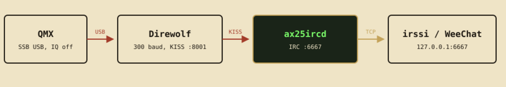

# ax25ircd

An IRC server that is also an AX.25 packet-radio gateway. People with an
ordinary IRC client and people with a radio and a TNC talk in the same
channels.

Three binaries: **`ax25ircd`** (gateway), **`ax25irc-station`** (radio-side
client), **`ax25irc-kisshub`** (virtual channel, no licence).

!!! warning "Read this before you transmit"
    Enabling `radio.enabled` makes your station transmit automatically, under
    your callsign, carrying other people's traffic. See [Regulatory](regulatory.md).

[Quick start](quickstart.md){ .md-button .md-button--primary }
[QMX on Debian](qmx.md){ .md-button }
[Install binaries](install.md){ .md-button }
